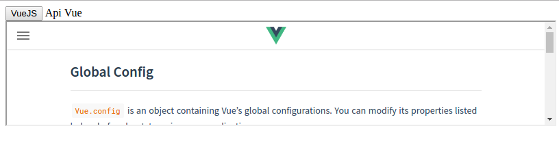

# Vue-frame

> A simple component Vue 2.0 for prototyping interfaces with iframes.

### Usage

This is a project template for [vue](https://github.com/vuejs).

```html
<scrit src="https://unpkg.com/vue/dist/vue.js"></script>

<div id="vue-frame">
   <vue-frame text="VueJS" url="https://vuejs.org" frame="myframe" type="button" class="form-control"></vue-frame>
   <vue-frame text="Api Vue" url="https://vuejs.org/v2/api" frame="myframe" type="a"></vue-frame>
   <br>

   <iframe id="myframe" width="800"></iframe>
</div>

<script src="src/vue-frame.js"></script>
```

The rendered elements look like this:



### PropTypes

| Prop  | Desc          | Type  | Default | Is Required |
| ----- | ------------- | ----- | ------- | ------ |
| `class` | Custom class to add to the **component** | `string` |  |  |
| `url` | Custom url that the component will load | `string` |  | ✅ |
| `text` | Custom text | `string` |  | ✅ |
| `frame` | Iframe element ID | `string` | | ✅ |
| `type` | Name of the HTML tag to render | `string` | | |

#### Example
```html
<vue-frame text="VueJS" url="https://vuejs.org" frame="idframe" type="div" class="form-control"></vue-frame>
```

### Fork It And Make Your Own

You can fork this repo to create your own boilerplate.
